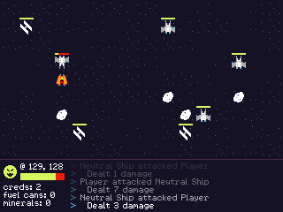
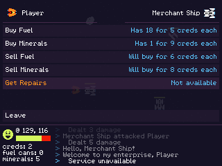

Space Station Plunder
=====================

A space roguelike game made for 7DRL 2017! Original development happened March 5th-12th.

Controls
--------

* Use the arrow keys to move the ship around. Move into things to interact with them.
* Press Z to change your attitude toward others when interacting with them.
* Use the arrows to navigate menus, Z to select an item, and X to go back.
* You can also use a gamepad.

License
-------

Copyright 2017 Alex Margarit (alex@alxm.org)

* Code licensed under [GNU GPL3](https://www.gnu.org/licenses/gpl.html) (see `COPYING`)
* Graphics licensed under [CC BY-NC-ND 4.0](https://creativecommons.org/licenses/by-nc-nd/4.0/) (see `CC-BY-NC-ND`)
