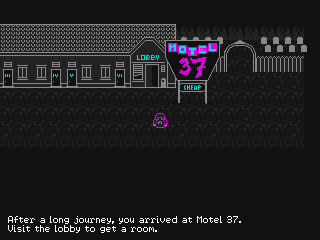
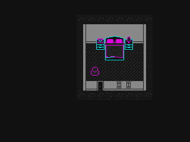

Motel 37
========

Motel 37 is a game I made for the Ludum Dare 37 48h Compo.

 

Build from Source
-----------------

* Install a2x `rel_ld37` from [here](https://github.com/alxm/a2x/tree/rel_ld37)
* Clone this repo, `cd make && make` or `make -f Makefile.mingw`

License
-------

Copyright 2016 Alex Margarit (alex@alxm.org)

* Code licensed under [GNU GPL3](https://www.gnu.org/licenses/gpl.html) (see `COPYING`)
* Graphics licensed under [CC BY-NC-ND 4.0](https://creativecommons.org/licenses/by-nc-nd/4.0/) (see `gfx/CC-BY-NC-ND`)
