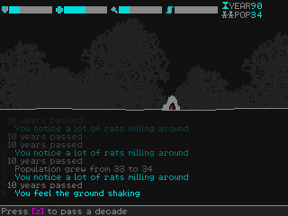
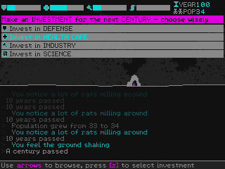

38th Century
============

 

**38th Century** is a simple world simulation game made from scratch in 72h for Ludum Dare 38.

When a century is up, use the clues you noticed every decade to make the best investment for the century ahead (in one of *defense, health care, industry, or science*). If your prediction was correct, your population will be sheltered from the inevitable disasters that strike every 100 years.

Running
-------

Download binaries from [https://alxm.itch.io/38th-century](https://alxm.itch.io/38th-century)

### Windows

* Built for 64bit system
* Launch `38th-century.exe`

### Linux

* Built for 64bit Ubuntu 16.04/Linux Mint 18
* You may need to install these libraries: `libSDL2 libSDL2_mixer libpng12`
* Launch `38th-century`

Controls
--------

* Keyboard: arrows keys, z key, Enter key
* Gamepad: dpad/analog, A button, Start button

Building Source Code
--------------------

* Install a2x `rel_ld38` from [here](https://github.com/alxm/a2x/tree/rel_ld38)
* Clone this repo, `cd make && make` or `make -f Makefile.mingw64`

License
-------

Copyright 2017 Alex Margarit (alex@alxm.org)

* Code licensed under [GNU GPL3](https://www.gnu.org/licenses/gpl.html) (see `COPYING`)
* Graphics licensed under [CC BY-NC-ND 4.0](https://creativecommons.org/licenses/by-nc-nd/4.0/) (see `CC-BY-NC-ND`)
