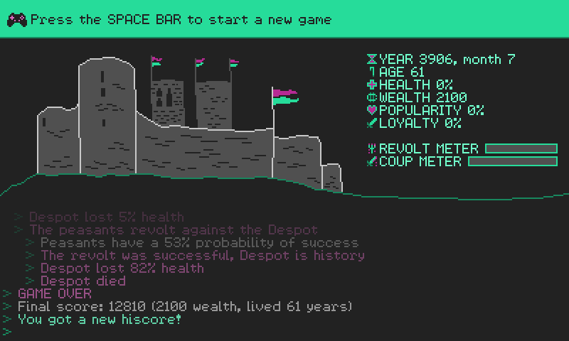

# Despot 3900

A game for Ludum Dare 39, with theme "Running out of Power". You play as a despot whose power is waning, and the goal is to accumulate as much wealth as possible and survive for as long as you can.

Download binaries from [https://alxm.itch.io/despot3900](https://alxm.itch.io/despot3900)

## Manual

As despot, you interact with two factions that don't like each other: peasants and nobles. You choose an action to perform every turn.

### Stats

* ***Year***: Each turn advances 6 months.
* ***Age***: Despot loses health points every turn after the age of 60, and faster every decade past.
* ***Health***: Game ends when health drops to 0.
* ***Wealth***: Final score is *Wealth * Age / 10*.
* ***Popularity***: The percentage of peasants that are on the despot's side.
* ***Loyalty***: The percentage of nobles that are on the despot's side.
* ***Revolt Meter***: When full, the peasants launch a revolt against the despot. Starts the count once popularity dips below 50%, and increments every turn with no way to stop it.
* ***Coup Meter***: When full, the nobles stage a coup against the despot. Starts the count once loyalty dips below 50%, and increments every turn with no way to stop it.

### Actions

* ***Do Nothing***: Recover health points at the expense of loyalty and popularity.
* ***Collect Taxes***: Take money from either peasants or nobles, at the expense of popularity or loyalty, respectively.
* ***Give Money***: Give money to one of the two factions to appease them, to the other's ire.
* ***Imprison Opponents***: When the Revolt or Coup Meters start to worry you, round up the ring leaders to stave off the inevitable. Need over 50% of the other faction's support.
* ***Wage War***: A gamble with large rewards in case of victory and large losses in case of defeat. Incurs some losses even if victorious, if popularity is under 33%.

## Running

### Windows

* Built for 64bit system
* Launch `despot3900.exe`

### Linux

* Built for 64bit Ubuntu 16.04/Linux Mint 18
* You may need to install these libraries: `libSDL2 libSDL2_mixer libpng12`
* Launch `despot3900`

## Building Source Code

* Install a2x `rel_ld39` from [here](https://github.com/alxm/a2x/tree/rel_ld39)
* Clone this repo, `cd make && make` or `make -f Makefile.mingw64`

## License

Copyright 2017 Alex Margarit (alex@alxm.org)

* Code licensed under [GNU GPL3](https://www.gnu.org/licenses/gpl.html) (see `COPYING`)
* Graphics and sound licensed under [CC BY-NC-ND 4.0](https://creativecommons.org/licenses/by-nc-nd/4.0/) (see `CC-BY-NC-ND`)
