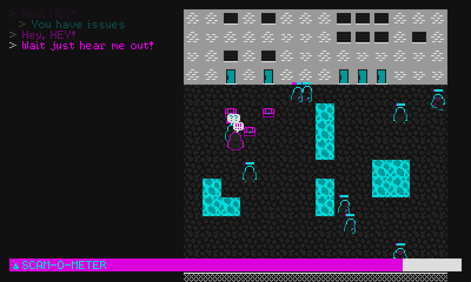

# Pestering Peddler

A game for the 48h Seattle Indies Game Jam with the theme "*Definitely not a scam*".

Download binaries from [https://alxm.itch.io/pestering-peddler](https://alxm.itch.io/pestering-peddler)

## Running

### Windows

* Built for 64bit system
* Launch `pestering-peddler.exe`

### Linux

* Built for 64bit Ubuntu 16.04/Linux Mint 18
* You may need to install these libraries: `libSDL2 libSDL2_mixer libpng12`
* Launch `pestering-peddler`

## Instructions

### Controls

* Move with the arrow keys or controller dpad
* Press the Space bar or controller (A) to close the deal

### Goal

The goal is to pester people until they listen to your pitch. Keep getting in someone's face until their persuasion bar is full. When that happens, you have a chance to make your pitch and close the deal by pressing Space or (A) when "*Buy*" flashes on the screen.

The *Scam-o-meter* is set off when you pester someone, and the game is over when it's full. The *Scam-o-meter* freezes after a successful scam, and resumes when you get in someone's face again.

## License

Copyright 2017 Alex Margarit (alex@alxm.org)

* Code licensed under [GNU GPL3](https://www.gnu.org/licenses/gpl.html) (see `COPYING`)
* Graphics and sound licensed under [CC BY-NC-ND 4.0](https://creativecommons.org/licenses/by-nc-nd/4.0/) (see `CC-BY-NC-ND`)
